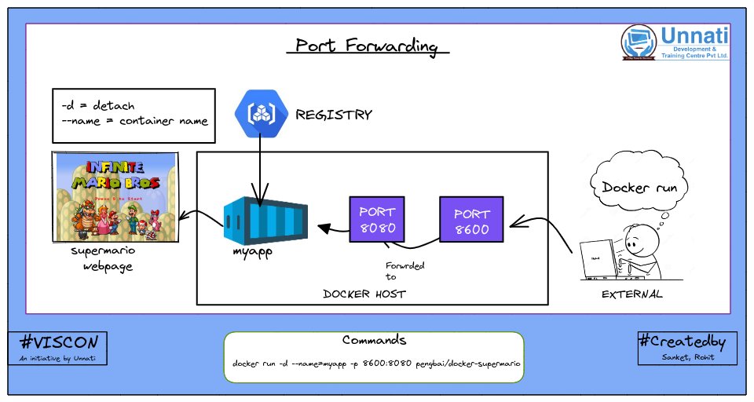

***Unnati Development and Training Center*** 

**Viscon**

|**Sr. No.**|**Description**|**Image**|
| :-: | :-: | :-: |
|1\.|Docker's architecture consists of several components that work together to create a platform for building, shipping, and running applications in containers.||
|2\.|A container is a sandboxed process running on a host machine that is isolated from all other processes running on that host machine.||
|3\.|To run a Docker container, you need to use the docker run command followed by the name of the Docker image you want to use. This command will create and start a new container based on the specified image.||
|4\.|This slide shows key points diffrentiating virtual machine with container.||
|5\.|This images shows different types of container images.||
|6\.|The docker rename command is used to rename a Docker container. It allows you to change the name of an existing container to a new name, making it easier to identify or manage containers in your Docker environment.||
|7\.|The docker rmi command is used to remove Docker images from your local system. It allows you to delete one or more images that you no longer need, freeing up disk space.||
|8\.|Deploying a MySQL database and a WordPress application in a multitier architecture using Docker||
|9\.|Deploying a postgres database and a gogs application in a multitier architecture using Docker||
|10\.|A network bridge is a default networking mode that allows containers to communicate each other and with the host system over a private internal network.||
|11\.|Port forwarding, also known as port mapping, is a networking technique used to redirect network traffic from one port on a host system to another port on another host or container.||
|12\.|Post forwarding of hello-openshift container||
|13\.|Port forwarding for supermario container||
|14\.|Volumes are persist data beyond the lifecycle of container. It allow to manage and store data separately from the container itself which is particularly useful for maintaining data between container restarts, updates, and when containers are removed.||
|15\.|This image shows how docker network host works.||
|16\.|A Dockerfile is a text file that contains a set of instructions for building a Docker image. Each instruction in the Dockerfile corresponds to a specific action that is executed when the image is being built.||
|17\.|The ADD command in Dockerfile is used to copy files/directories into a Docker image while building the image.||
|18\.|The COPY command in Dockerfile copies files or directories from the build context (where the Dockerfile is located) to the image. It's used to include application code, configuration files, and other assets.||
|19\.|The WORKDIR command sets the working directory for any subsequent instructions. Commands like RUN, CMD, and ENTRYPOINT will be executed in the set working directory.||
|20\.|The CMD in Dockerfile specifies the default command to run when a container is started. It can be overridden by providing a command when running the container.||
|21\.|The ENV in Dokcerfile is used to set environment variables in the image. These variables can be used by processes running in the container.||
|22\.|In a Dockerfile, the USER instruction is used to specify the user that will be used to run commands when the container starts.||
|23\.|Similar to CMD, but provides a fixed command that can't be overridden directly when running the container.||
|24\.|The HEALTHCHECK instruction in a Dockerfile is used to define a health check for a container. A health check is a command or a script that Docker periodically runs to determine whether a container is healthy or not.||
|25\.|The MAINTAINER instruction in a Dockerfile used to be used to specify the name and email address of the person or organization responsible for maintaining the image.||
|26\.|The docker load command is used to load images that have been previously saved using the docker save command. This command is used to restore Docker images from a tarball archive file created with docker save.||
|27\.|Docker Compose is a tool for defining and running multi-container Docker applications. It allows you to use a single configuration file to describe the services, networks, and volumes required for your application, .||
|28\.|Docker Swarm is Docker's native container orchestration platform that enables you to create and manage a cluster of Docker nodes (machines) to deploy and scale containerized applications. ||
|29\.|The docker stack command is used to deploy and manage services defined in a Docker Compose file as part of a Docker swarm mode cluster.||
